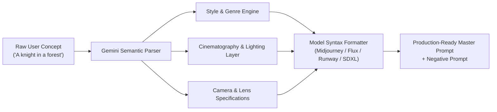

# 🎨 AI Prompt Studio — Next-Gen Generative Prompt Engineering

[](https://aistudio.google.com/)
[](https://aistudio.google.com/apps)
[]()
[](LICENSE)

<div align="center">
  
  
  <p align="center">
    <strong>Transform rough concepts into production-grade image and video generative prompts using multi-tier optimization and Gemini AI.</strong>
  </p>
</div>

---

## 🚀 Overview
**AI Prompt Studio** is an intelligent prompt-crafting engine built to bridge the gap between creative intent and high-fidelity output in generative AI models. 

Modern generative image and video models (such as Midjourney, Flux, Stable Diffusion XL, Google Imagen, Runway Gen-3, Luma Dream Machine, Kling, and Sora) require precise, multi-dimensional descriptors to produce photorealistic or stylized artistic results. AI Prompt Studio takes raw, simple ideas and systematically expands them into rich, parameter-tuned prompts with photographic precision, lighting specifications, directorial staging, and model-specific syntax.

---

## ✨ Key Features

### 1. Multi-Tier Prompt Optimization
* **Tier 1 (Core Subject Enhancement)**: Deepens character/subject anatomy, textures, expressions, and wardrobe specifics.
* **Tier 2 (Cinematic Staging & Lighting)**: Infuses volumetric lighting, golden hour, chiaroscuro, rim lighting, atmospheric haze, and lens optical traits.
* **Tier 3 (Camera & Technical Parameters)**: Embeds specific focal lengths (e.g., 35mm, 85mm f/1.4), film stocks (Kodak Portra, Cinestill 800T), render engines (Unreal Engine 5, Octane Render), and aspect ratio flags (`--ar 16:9`, `--v 6.1`).

### 2. Multi-Model Target Synthesizer
Tailors syntax and emphasis depending on the destination diffusion or autoregressive engine:
* **Midjourney (v5/v6/v6.1)**: Parameter tags (`--stylize`, `--chaos`, `--weird`, `--aspect`, `--no`).
* **Stable Diffusion / SDXL / Flux**: Positive prompt weight emphasis `(masterpiece:1.2)`, detailers, and structured negative prompt banks.
* **Generative Video (Runway, Kling, Sora, Luma)**: Adds motion vectors, camera movements (pan, tilt, crane, dolly zoom), speed ramps, and frame-to-frame continuity markers.
* **Google Imagen 3**: Natural language semantic descriptive fidelity.

### 3. Granular Creative Controls
* **Artistic Style Library**: Cyberpunk, Baroque, Editorial Fashion, Sci-Fi Brutalism, Minimalist Architectural, Hyperrealistic Macro, Studio Ghibli Anime, Watercolor, and more.
* **Lighting Architect**: Studio softbox, neon backlighting, bioluminescence, overcast diffuse, ray-traced shadows.
* **Negative Prompt Generator**: Automatically crafts exclusions for artifacts, anatomical distortions, chromatic aberrations, and unwanted artifacts.
* **Instant Export**: Copy to clipboard with single-click formatted output ready to paste into Discord bots or generation interfaces.

---

## 🧠 Prompt Engineering Architecture



---

## 🛠️ Prompt Optimization Example

### Raw Input:
> *"A vintage car driving on a rainy road at night"*

### AI Prompt Studio Output (Photorealistic Cinematic):
```text
Cinematic wide tracking shot of a 1968 Ford Mustang Fastback driving along a glistening asphalt coastal highway at midnight, rain pouring with hyper-detailed water droplets reflecting off obsidian metallic lacquer. Illuminated by amber streetlights and neon signage refracting through puddle reflections, cinematic moody atmospheric mist, anamorphic lens flare, shot on ARRI Alexa Mini, 35mm Master Prime lens, f/2.0, shallow depth of field, high-contrast chiaroscuro lighting, photorealistic textures, 8k resolution, color graded with teal and warm amber hues --ar 16:9 --style raw --v 6.1
```

### Negative Prompt:
```text
cartoon, 3d render, plastic, oversaturated, deformed wheels, blurry reflections, low resolution, artifacts, mutated geometry, text, watermark
```

---

## 💡 Built With
* **AI Engine**: Google Gemini Models via [Google AI Studio](https://aistudio.google.com/)
* **Platform**: Google AI Studio App Ecosystem
* **Core Disciplines**: Advanced Prompt Engineering, Multimodal Generative AI, Latent Diffusion Parameter Optimization

---

## 📄 License
This project is open-source and available under the [MIT License](LICENSE).
